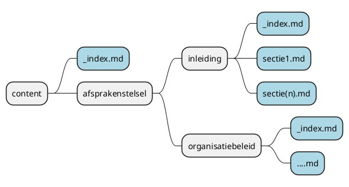

# Dummy pagina voor het Afsprakenstelsel iWlz

Afsprakenset iWlz *op basis van registers*

Zie publicatie https://zandbak_rr.gitlab.io/dummy2/ 

**Hier komt een andere inhoud en lokatie voor.**

[[_TOC_]]

# Opbouw pagina's en repository

## basis
Het beheer van de content voor de publicatie is momenteel gebaseerd op het gebruik van onderstaande open source componenten:

- GitLab Pages: official documentation](https://docs.gitlab.com/ce/user/project/pages/).
- [HUGO SSG](https://gohugo.io) (Static Site Generator) waarbij i.c.m [GitLab Pages](https://about.gitlab.com/stages-devops-lifecycle/pages/)
- [HUGO Book Theme](https://github.com/alex-shpak/hugo-book)
### Hugobook template: 
- https://geekdocs.de
- https://github.com/thegeeklab/hugo-geekdoc

## Bijwerken content

Ga naar folder [content](content) in de repository. En pas de *Markdown* bestanden aan. 

Onderstaande Mindmap geeft de generieke indeling weer.



In bovenstaande figuur staan de verschillende onderdelen waaruit de content is opgebouwd / kan worden opgezet:

- direct onder folder content de site-pagina content in een `_index.md`

- de folder `afsprakenstelsel` met daarin alle hoofdstukken uit het te publiceren *"boek"*

- de `hoofdstukken` als folders onder `docs`

- in elk 'hoofdstuk' folder
  - de hoofdstuk-pagina content in een `_index.md`
  - de hoofdstuk-sectie content in 1 of meerdere `...md` (s)

### PlantUML diagrammen embedden in Markdown: 

Zet hiervoor de inhoud van de puml tussen de speciale plantuml-syntax: (bijvoorbeeld uml-diagram)


```markdown
      ```plantuml
      @startuml
      puml-inhoud
      @enduml
      ```
```

### Gebruik van HUGO Geekdoc Theme

Korte samenvatting (van de tot nu toe) meest gebruikte speciale elementen HUGO Book Theme.

#### Front Matter

In een SSG zoals HUGO kunnen pagina's lokaal worden geconfigureerd met zogenaamde *Front Matter variabelen* die aan het begin van de pagina kunnen worden opgegegeven. Hieronder een voorbeeld met de meest voorkomende variabelen.

```yaml
---
title: "<Titel-weergave in (sub)menu>"
bookCollapseSection: <true/false>
weight: <Nummerieke volgorde in (sub)menu>
---
```

| Variabele | Omschrijving toepassing |
|:-|:-|
| title | Titel die in het linker (sub)menu zal worden weergegeven |
| bookCollapseSection | Waarde `true` plaatst een **>** achter de titel in het (sub)menu. Betekenis is dat het (sub)menu nog kan worden uitgeklapt met onderliggende submenu's. De waarde `false` (of variabele geheel weglaten) betekent dat eventuele submen's direct uitgeklapt worden getoond |
| weight | In een `_index.md` (hoofd-pagina) betekent de volgorde van de hoofdstuk-pagina ten opzichte van de andere hoofdstuk-pagina's op hetzelfde niveau. In de overige *sectie-pagina's* de volgorde binnen het hoofdstuk waaronder deze valt. |


####  Shortcodes

Met *Shortcodes* kan de standaard *Markdown-tekst* worden uigebreid met specifieke opmaak binnen het Theme.

##### Hints
Bekijk voor alle mogelijkehden de [documentatie op Geekdocs](https://geekdocs.de/shortcodes/hints/)

De *Hint shortcode* kan worden gebruikt als informatie/waarschuwings/let op! block.  
Er zijn 5 soorten om uit te kiezen: `important`, `warning`,`dancautionger`. `note` en `tip`

```html

**Markdown content**  
Lorem markdownum insigne. Olympo signis Delphis! Retexi Nereius nova develat
stringit, frustra Saturnius uteroque inter! Oculis non ritibus Telethusa

```

##### Columns

```html
 <!-- begin kolommen block -->
# Linker Content
Lorem markdownum insigne...

<---> <!-- scheiding tussen kolommen -->

# Midden Content
Lorem markdownum insigne...

<---> <!-- scheiding tussen kolommen  -->

# Rechter Content
Lorem markdownum insigne...
 <!-- einde kolommen block -->
```

##### Tabs

Met *Tabs* kan je content met elkaar gerelateerde of vanuit verschillende contexten of onderdelen organiseren, bijvoorbeeld een onderdeel van een handleiding voor de verschillende ondersteunde platforms (MacOS, Linux en Windows).

```html



# MacOS Content




# Linux Content




# Windows Content



```


## GitLab CI/CD
This project's static Pages are built by [GitLab CI/CD](https://about.gitlab.com/stages-devops-lifecycle/continuous-integration/),
following the steps defined in [`.gitlab-ci.yml`](.gitlab-ci.yml).

Read more at Hugo's [documentation](https://gohugo.io/getting-started/).


## Troubleshooting

### CSS is missing! That means two things:

- Either that you have wrongly set up the CSS URL in your templates.
- Or your static generator has a configuration option that needs to be explicitly
  set in order to serve static assets under a relative URL.

### Hugo fails to build the website

If the version of `hugo` or `hugo_extended` is 0.92.2 or later, you may have problems building the website.

Generics were introduced in [Go 1.18](https://go.dev/blog/go1.18), and they broke some features in the newer versions of Hugo. For now, if you use `hugo` or `hugo_extended` versions 0.92.2 or later, you might encounter problems building the website. To resolve the problem:

1. Edit your `.gitlab-ci.yaml` file.
1. Identify the line that declares the Hugo version.
1. Change the value to `:0.92.2`.
1. Save your changes

For more information about this issue:

- This issue is tracked in [Gitlab Hugo template fails CI/CD build with "latest" docker version](https://gitlab.com/pages/hugo/-/issues/69).
- For discussions about fixing the problem in Hugo, and proposals to potentially resolve these issues, read [proposal: spec: allow type parameters in methods](https://github.com/golang/go/issues/49085).
